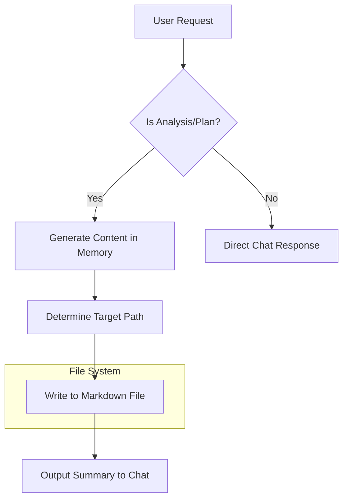

# Documentation & Persistence (MANDATORY)

**Do not just output to chat.** You must save the detailed analysis to a file.

## 1. Directory Structure Standards
*   **Target Directory:** `./Docs/PLAN/[TR1-Plan]/` (Create this folder if it doesn't exist).
*   **Target SubDirectory:** `[Problem-Name]/[AI-Recommended-Version]`
    *   `[Problem-Name-suffix]`: Problem name of the topic (e.g., `Revision RVM Machines`, `Implementation RVM Edge`).
    *   `[AI-Recommended-Version]`: Determine the specific focus of the analysis version.

## 2. Filename Convention
`[Target-Product-Name]-[AI-Recommended-Suffix].md`
*   `[Target-Product-Name]`: Kebab-case name of the analyzed product (e.g., `biolink-boost`).
*   `[AI-Recommended-Suffix]`: Determine the specific focus of the analysis:
    *   If general analysis: `-full-audit`
    *   If UI focus: `-ui-ux-breakdown`
    *   If technical focus: `-tech-stack-review`
    *   If business model focus: `-monetization-strategy`

**Example:** `Docs/PLAN/TR1-Plan/Revision-RVM-Machines/v1.0/biolink-boost-full-audit.md`

## 3. Implementation Example

### Scenario: Auditing a Watermark Feature
If you are analyzing the watermark feature of GardaIdentitas, you should create:
`Docs/PLAN/TR1-Plan/GardaIdentitas-Features/v1.0/watermark-module-tech-review.md`

**Content Template:**
```markdown
# Watermark Module Technical Review

## Overview
Analysis of client-side canvas implementation for watermarking.

## Key Findings
1. Performance: 15ms render time on average devices.
2. Privacy: No network requests observed.

## Recommendations
- Add WebWorker for non-blocking UI on large images.
```

## 4. Persistence Flow Diagram



## 5. System Limitations & Requirements
*   **File Access**: The agent must have write permissions to the `./Docs` directory.
*   **Format**: All documentation must be in standard Markdown.
*   **Idempotency**: Repeated runs should update existing files or create versioned copies, not duplicate content endlessly.

## 6. Troubleshooting
*   **Error: Directory not found**: 
    *   *Solution*: Use `mkdir -p` logic or equivalent tool to create the full path before writing.
*   **Error: Permission Denied**:
    *   *Solution*: Verify the workspace permissions. If persistent, output to root `TEMP_DOCS` folder and notify user.
*   **Issue: Content truncated**:
    *   *Solution*: Split large analyses into multiple files (e.g., `part-1`, `part-2`).
